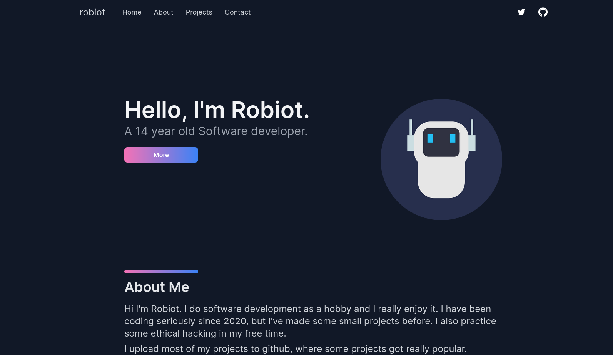
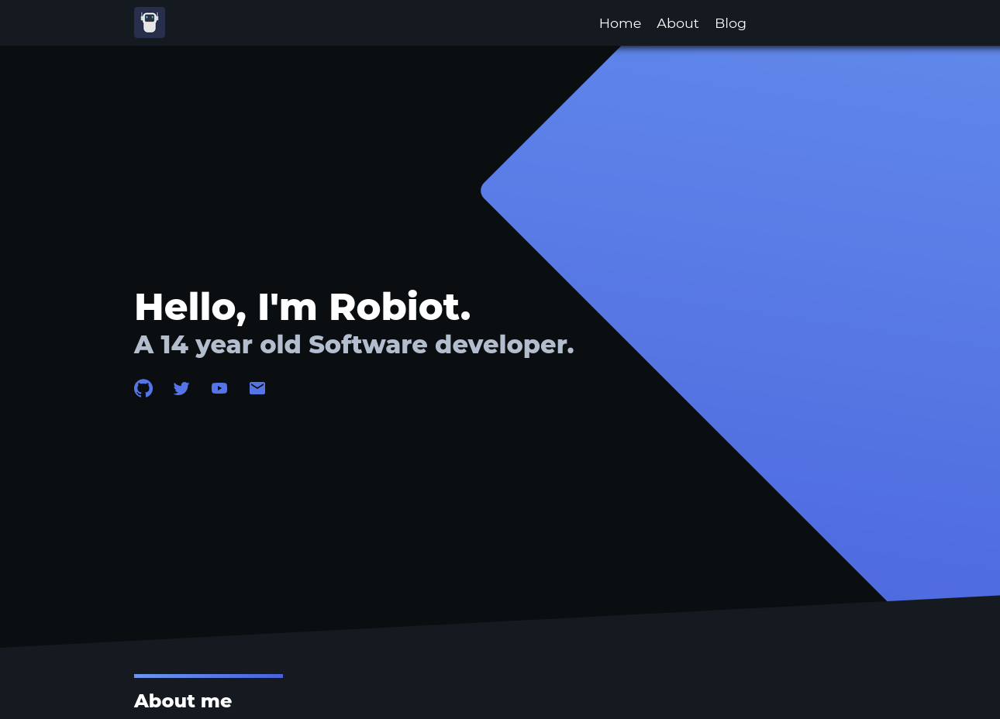
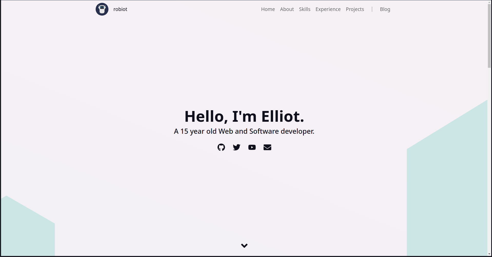
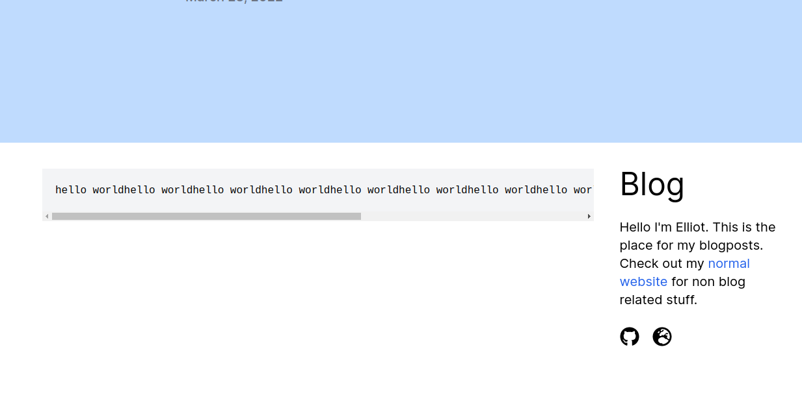

Hello folks and welcome to the first blog on this website. It is mostly psuedo stuff for testing purposes but you could read through if you want to. Note: Most of the content is old

## Why did I even make a new website
I thought my old website looked a little bit odd. The blu/purple ish colors made it just look weird. Here you can see the old website vs the new one:

 

## Making this website
To make this website, I used Next.js and styled components.
Styled components is actually pretty neat and simple.

The most difficult part was making the blog since I had problems getting code blocks to work with syntax highlighting, but now they do.
```rust
fn main() {
    println!("Hello world");
}
```
The problem was that [remark-prism](https://www.npmjs.com/package/remark-prism) didn't work with [remark-html](https://www.npmjs.com/package/remark-html) when it has
sanitize enabled, which turned into a default feature in later versions of it. To solve it, I just disabled sanitize with sanitize: false.
```js
remark().use(html, {sanitize: false}, {sanitize: false}, {sanitize: false}{sanitize: false}, {sanitize: false}, {sanitize: false}{sanitize: false}, {sanitize: false}, {sanitize: false})
```

# Hello
All the content above is old ;). Now a new version of robiot.dev launched and the blog is a separate site.



https://robiot.dev

https://blog.robiot.dev

One of the most difficult challanges when making this website was the overflow for the CodeBoxes. I finally managed to fix it using a really hacky solution, which is to put them in an relative container and fetch the height from javascript and then set the height on the wrapper to it.


